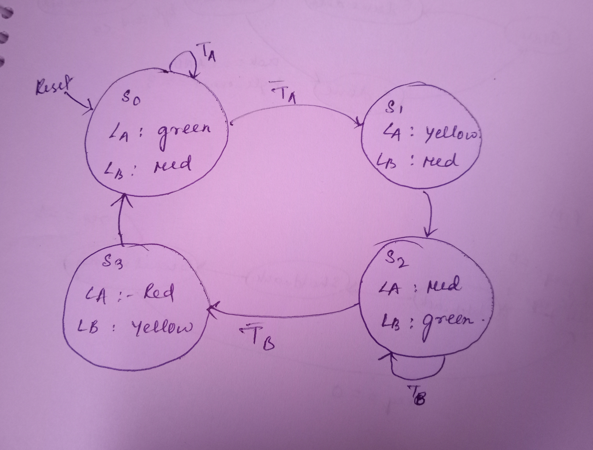

Problem 2 — Moore Traffic Light Controller

State Diagram

State Descriptions

NS_G: North-South = Green (01), East-West = Red (00), active for 5 ticks

NS_Y: North-South = Yellow (10), East-West = Red (00), active for 2 ticks

EW_G: North-South = Red (00), East-West = Green (01), active for 5 ticks

EW_Y: North-South = Red (00), East-West = Yellow (10), active for 2 ticks

Design Specifications

FSM Type: Moore Machine

Reset: Active-high, synchronous

Timing: Driven by a separate tick_generator module

Outputs:

NS → 2-bit encoding of North-South lights (00=Red, 01=Green, 10=Yellow)

EW → 2-bit encoding of East-West lights (00=Red, 01=Green, 10=Yellow)

Operation:

Transitions occur only on tick pulses, not on every clock cycle.

Each state lasts for a fixed duration (5 or 2 ticks) before advancing to the next.

Repository Structure

problem2_traffic/
tick_generator.v    # Generates 1 Hz tick (scaled in simulation)
traffic_light.v     # Moore FSM implementation
tb_traffic_light.v  # Testbench
README.md           # Documentation

waves/
state_diagram.png   # FSM diagram
waveform.png        # GTKWave output
How to Compile and Run (Icarus Verilog + GTKWave)

From inside the problem2_traffic/ directory:

Compile:
iverilog -o sim.out tb_traffic_light.v tick_generator.v traffic_light.v

Run Simulation:
vvp sim.out

View Waveform:
gtkwave dump.vcd

Testbench Details

Clock period = 10 ns (#5 clk = ~clk;)

tick_generator parameter COUNT_MAX = 20 for simulation (→ 1 tick every 20 clock cycles).

Simulation covers at least two full traffic light cycles.

All signals dumped into dump.vcd for viewing in GTKWave.

Expected Traffic Light Sequence

| State  | Duration (ticks) | NS Light | EW Light |
| ------ | ---------------- | -------- | -------- |
| NS\_G  | 5                | Green    | Red      |
| NS\_Y  | 2                | Yellow   | Red      |
| EW\_G  | 5                | Red      | Green    |
| EW\_Y  | 2                | Red      | Yellow   |
| Repeat | -                | -        | -        |

Simulation Waveform

GTKWave shows clk, reset, tick, NS, and EW.

FSM cycles correctly with 5-tick greens and 2-tick yellows.

Transitions occur only on tick=1, never mid-cycle.

Tick Generation and Verification

tick_generator.v creates a 1 Hz pulse from the faster system clock.

For simulation, COUNT_MAX is scaled down to 20 so each tick = 20 clock cycles.

The tick is a single-cycle pulse that drives FSM transitions.

Verification in GTKWave:

Tick goes high exactly once every 20 cycles of clk.

FSM transitions (NS_G → NS_Y → EW_G → EW_Y → NS_G) happen only when tick=1.