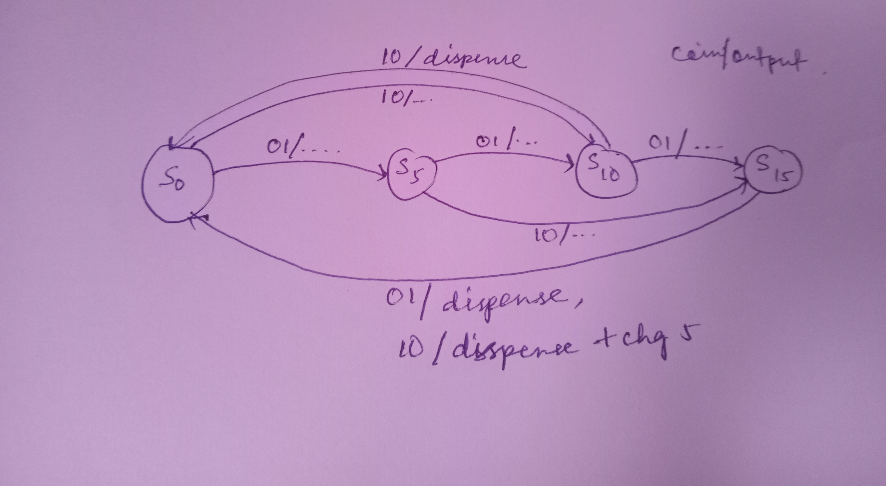

Problem 3 — Vending Machine (Mealy FSM)

Problem Description

Design a Mealy-type FSM to implement a vending machine with the following behavior:

State Diagram 

Item cost: 20

Accepted coins: 5 and 10

Dispense condition: Machine releases the product once the total reaches 20.

Change rule: If 25 is inserted (e.g., 15 + 10), the product is dispensed and 5 is returned as change.

The FSM must follow synchronous coding style (state register updated on posedge clk) with outputs defined as wires.

FSM Design
States

S0: Balance = 0

S5: Balance = 5

S10: Balance = 10

S15: Balance = 15

Transitions

From S0:

coin=5 → S5

coin=10 → S10

From S5:

coin=5 → S10

coin=10 → S15

From S10:

coin=5 → S15

coin=10 → Dispense, then return to S0

From S15:

coin=5 → Dispense, then return to S0

coin=10 → Dispense + return 5 as change, then go to S0

State Diagram

Edges are labeled as coin / outputs.

Example: S15 -- coin=10 --> S0 [dispense=1, chg5=1].

RTL Files

vending_mealy.v — RTL design implementing the FSM

tb_vending_mealy.v — Testbench applying coin input sequences

Running the Simulation (Icarus Verilog + GTKWave)
iverilog -o sim.out tb_vending_mealy.v vending_mealy.v
vvp sim.out
gtkwave dump.vcd
