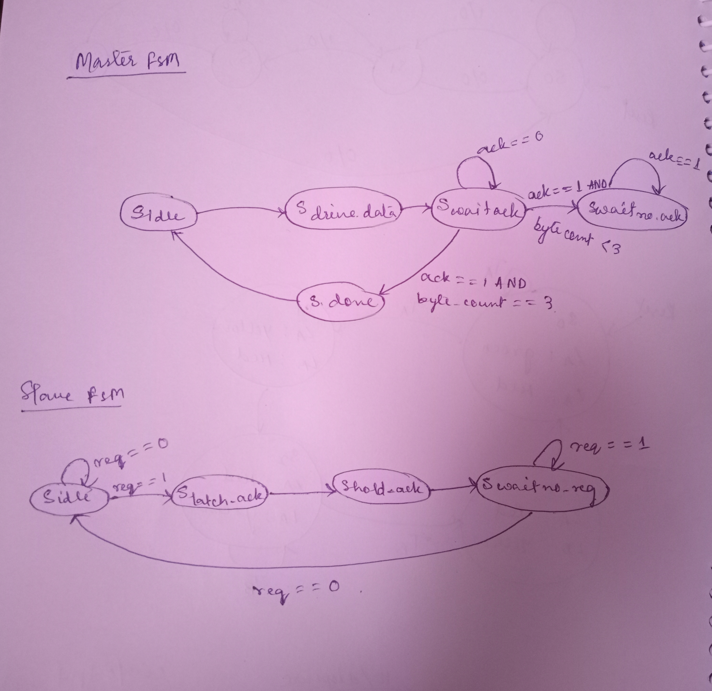

Problem 4 — 4-Phase Handshake (Master–Slave Link)
Overview

Design and implement two synchronous FSMs that communicate using a 4-phase request/acknowledge handshake to transfer 4 bytes.

Protocol (per byte):

Master drives data and asserts req.

Slave captures the data, raises ack, and keeps it high for 2 cycles.

Master deasserts req.

Slave lowers ack.

After transmitting all 4 bytes, the Master asserts done = 1 for a single cycle.

Why Two FSMs and the 4-Phase Protocol?

Separation of roles: Master = producer, Slave = consumer.

Race-free communication: The 4-phase sequence (req↑ → ack↑ → req↓ → ack↓) is deterministic and straightforward to validate in waveform simulations.

Modules

master_fsm.v — Sends 4 bytes (A0..A3) through states:
IDLE → LOAD → ASSERT_REQ → WAIT_ACK_H → DROP_REQ → WAIT_ACK_L → NEXT → DONE.

slave_fsm.v — On req=1, latches data_in, raises ack for 2 cycles, then waits for req=0 to deassert.

link_top.v — Connects the Master and Slave modules.

tb_link_top.v — Testbench providing clk/rst and terminating after done.

State Diagrams

Master FSM
| Current State        | Input Condition               | Next State       | Description                        |
| -------------------- | ----------------------------- | ---------------- | ---------------------------------- |
| **S\_IDLE**          | Always                        | S\_DRIVE\_DATA   | Begin transfer                     |
| **S\_DRIVE\_DATA**   | Always                        | S\_WAIT\_ACK     | Wait for Slave’s acknowledgment    |
| **S\_WAIT\_ACK**     | ack == 0                      | S\_WAIT\_ACK     | Keep waiting                       |
|                      | ack == 1 AND byte\_count < 3  | S\_WAIT\_NO\_ACK | Ack received, prepare next byte    |
|                      | ack == 1 AND byte\_count == 3 | S\_DONE          | Ack received for last byte         |
| **S\_WAIT\_NO\_ACK** | ack == 1                      | S\_WAIT\_NO\_ACK | Wait for Slave to drop ack         |
|                      | ack == 0                      | S\_DRIVE\_DATA   | Handshake complete, send next byte |
| **S\_DONE**          | Always                        | S\_IDLE          | Transmission finished              |

Slave FSM
| Current State        | Input Condition | Next State       | Description                        |
| -------------------- | --------------- | ---------------- | ---------------------------------- |
| **S\_IDLE**          | req == 0        | S\_IDLE          | Waiting for request                |
|                      | req == 1        | S\_LATCH\_ACK    | Request detected, start ack        |
| **S\_LATCH\_ACK**    | Always          | S\_HOLD\_ACK     | Hold ack for 2nd cycle             |
| **S\_HOLD\_ACK**     | Always          | S\_WAIT\_NO\_REQ | Ack complete, wait for req to fall |
| **S\_WAIT\_NO\_REQ** | req == 1        | S\_WAIT\_NO\_REQ | Keep waiting                       |
|                      | req == 0        | S\_IDLE          | Handshake finished                 |

Running the Simulation (Icarus Verilog + GTKWave)
iverilog -o sim.out tb_link_top.v link_top.v master_fsm.v slave_fsm.v
vvp sim.out
gtkwave handshake_waves.vcd
